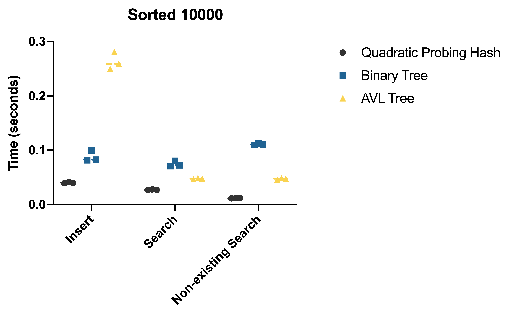
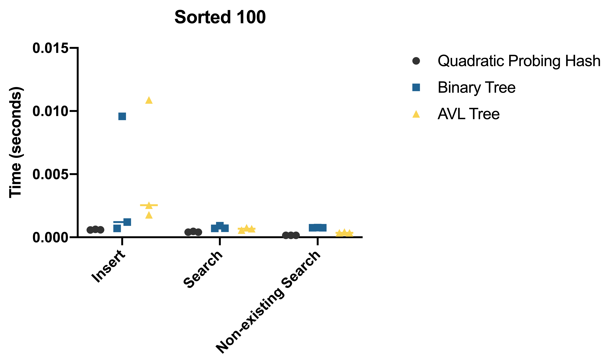
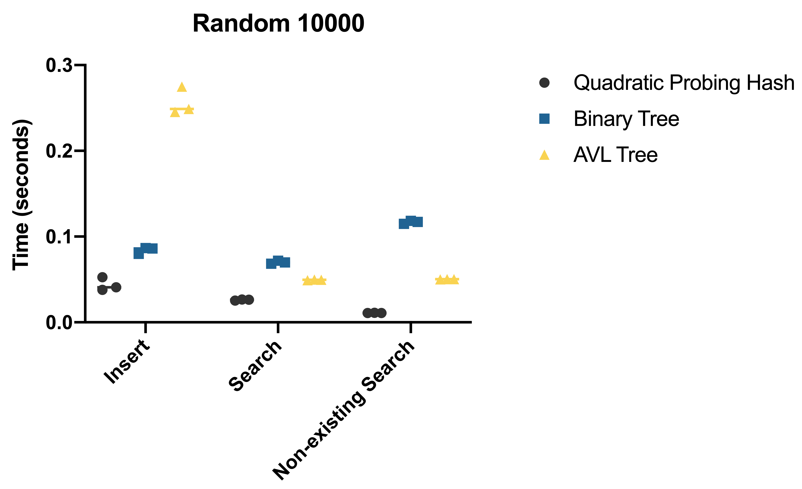
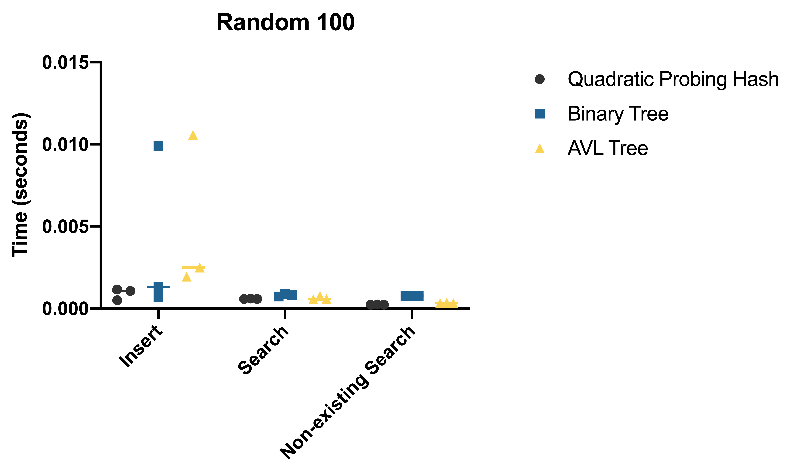

# Trees
A implementation of binary tree that is used to compare with other data structures like AVL tree and Quadratic Hash Table.

## Integration Status


## Usage
To use the main program `insert_key_value_pairs.py`. You will need a list of data that has key and value separated by comma. To generate that list of data, you can run the included bash script by:
```
bash rand_word_generator.sh
```
Once you have the required text file, you can run the program by following command:
```
python insert_key_value_pairs.py --data_structure avl --dataset rand.txt --num_pairs 10000
```
The program will output the time it took to add and search for the elements, either they exist or not:
```
Insert time for avl: 0.02816486358642578
Search time for avl: 0.0041370391845703125
Search for nonexistent element time for avl: 0.0049631595611572266
```

## Benchmarking




